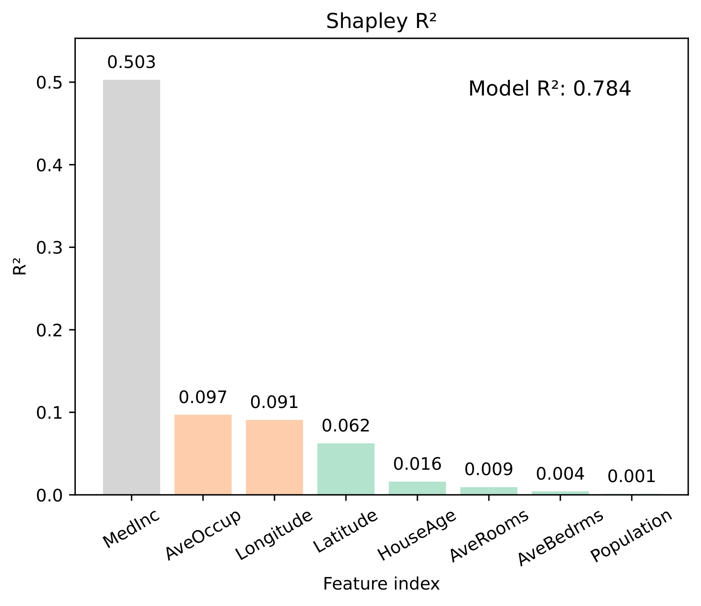

# Q-SHAP: Feature-Specific $R^2$ Values for Tree Ensembles

[](https://pypi.org/project/qshap/)
[](https://pepy.tech/project/qshap)

This package is used to compute feature-specific $R^2$ values, following Shapley decomposition of the total $R^2$, for tree ensembles in polynomial time based on the [paper](https://arxiv.org/abs/2407.03515).

This version only takes outputs from **XGBoost**, **LightGBM**, **scikit-learn Decision Tree**, and **scikit-learn GBDT**. We are working to update it for random forests in the next version. Please check **Q-SHAP Tutorial.ipynb** for more details using Q-SHAP.

## Installation

`qshap` can be installed through PyPI:

<pre>
pip install qshap
</pre>

## Quick Start

```python
# Import necessary libraries
from sklearn.datasets import fetch_california_housing
from qshap import gazer, vis
import xgboost as xgb
import numpy as np

# Load the California Housing dataset and fit a XGBoost regressor
housing = fetch_california_housing()
x, y, feature_names = housing.data, housing.target, housing.feature_names
model = xgb.XGBRegressor(max_depth=2, n_estimators=50, random_state=42).fit(x, y)

# Obtain feature-specific R^2 using qshap, use 1024 randomly sampled data
gazer_rsq = gazer(model)
phi_rsq = gazer.rsq(gazer_rsq, x, y, nsample=1024, random_state=42)

# Visualize top values of feature-specific R^2
vis.rsq(phi_rsq, label=np.array(feature_names), rotation=30, save_name="cal_housing", color_map_name="Pastel2")
```

<p align="center">
  
</p>

## Citation

```bibtex
@article{jiang2024feature,
  title={Feature-Specific Coefficients of Determination in Tree Ensembles},
  author={Jiang, Zhongli and Zhang, Dabao and Zhang, Min},
  journal={arXiv preprint arXiv:2407.03515},
  year={2024}
}
```

## References

- Jiang, Z., Zhang, D., & Zhang, M. (2024). "Feature-specific coefficients of determination in tree ensembles." arXiv preprint arXiv:2407.03515.
- Lundberg, Scott M., et al. "From local explanations to global understanding with explainable AI for trees." Nature Machine Intelligence 2.1 (2020): 56-67.
- Karczmarz, Adam, et al. "Improved feature importance computation for tree models based on the Banzhaf value." Uncertainty in Artificial Intelligence. PMLR, 2022.
- Bifet, Albert, Jesse Read, and Chao Xu. "Linear tree shap." Advances in Neural Information Processing Systems 35 (2022): 25818-25828.
- Chen, Tianqi, and Carlos Guestrin. "Xgboost: A scalable tree boosting system." Proceedings of the 22nd ACM SIGKDD International Conference on Knowledge Discovery and Data Mining. 2016.

## Container Images

We provide pre-built images, available for both Docker and Singularity, with all necessary packages for Q-SHAP in Python 3.12:

- **Docker:**  
  You can pull the Docker image using the following command:
  ```sh
  docker pull catstat/xai
  ```
- **Singularity:**  
  You can pull the Docker image using the following command:
  ```sh
  singularity pull docker://catstat/xai:0.1
  ```

## Task List

- [ ] Task 1: Catboost version
