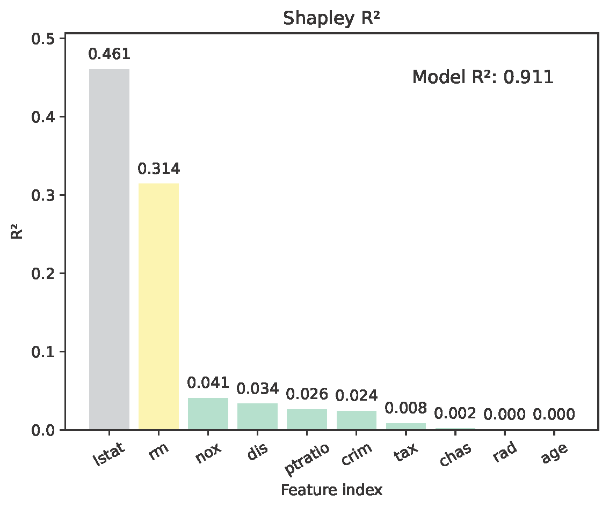

# Q-SHAP: Feature-Specific $R^2$ Values for Tree Ensembles

[](https://pypi.org/project/qshap/)
[](https://pepy.tech/project/qshap)

This package is used to compute feature-specific $R^2$ values, following Shapley decomposition of the total $R^2$, for tree ensembles in polynomial time based on the [paper](https://arxiv.org/abs/2407.03515).

This version only takes outputs from **XGBoost**, **LightGBM**, **scikit-learn Decision Tree**, and **scikit-learn GBDT**. We are working to update it for random forests in the next version. Please check [Q-SHAP Tutorial](./Q-SHAP%20Tutorial.ipynb) for more details using Q-SHAP.

## Installation

`qshap` can be installed through PyPI:

<pre>
pip install qshap
</pre>

## Quick Start

```python
# Import necessary libraries
from ISLP import load_data
from qshap import gazer, vis
import xgboost as xgb
import numpy as np

boston = load_data("Boston")

# ---- Load Boston Housing from ISLP ----
y = boston["medv"].to_numpy(dtype=np.float64)

# Features = everything except medv
X_df = boston.drop(columns=["medv"])
x = X_df.to_numpy(dtype=np.float64)

feature_names = X_df.columns.to_numpy()

# ---- Fit a XGBoost regressor ----
model = xgb.XGBRegressor(
    max_depth=2,
    n_estimators=50,
    random_state=42,
    learning_rate=0.1,
).fit(x, y)

# ---- Obtain feature-specific R^2 using qshap ----
g = gazer(model)

phi_rsq = g.rsq(x, y)


# ---- Visualize top feature-specific R^2 ----
vis.rsq(
    phi_rsq,
    label=feature_names,
    rotation=30,
    save_name="boston_housing",
    color_map_name="Pastel2"
)
```

<p align="center">
  
</p>

## Citation

```bibtex
@inproceedings{10.5555/3762387.3762469,
author = {Jiang, Zhongli and Zhang, Min and Zhang, Dabao},
title = {Fast calculation of feature contributions in boosting trees},
year = {2025},
publisher = {JMLR.org},
numpages = {17},
location = {Rio de Janeiro, Brazil},
series = {UAI '25}
}

```

## Reference
- Jiang, Z., Zhang, M., & Zhang, D. (2025). Fast calculation of feature contributions in boosting trees. *Proceedings of the 41st Conference on Uncertainty in Artificial Intelligence (UAI)*, 82:1859 - 1875


## Container Images

We provide pre-built images, available for both Docker and Singularity, with all necessary packages for Q-SHAP in Python 3.12:

- **Docker:**  
  You can pull the Docker image using the following command:
  ```sh
  docker pull catstat/xai
  ```
- **Singularity:**  
  You can pull the Docker image using the following command:
  ```sh
  singularity pull docker://catstat/xai:0.1
  ```

