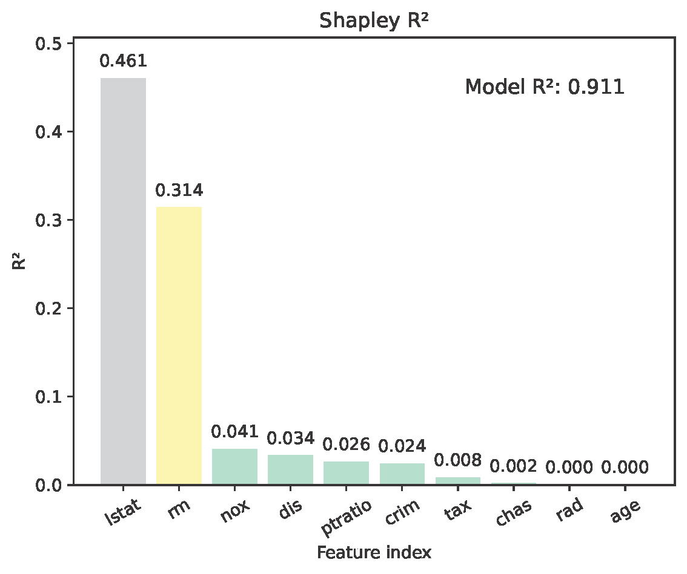

# Q-SHAP: Feature-Specific $R^2$ Values for Tree Ensembles

[](https://pypi.org/project/qshap/)
[](https://pepy.tech/project/qshap)

This package is used to compute feature-specific $R^2$ values, following Shapley decomposition of the total $R^2$, for tree ensembles in polynomial time based on the [paper](https://arxiv.org/abs/2407.03515).

This version supports **XGBoost**, **LightGBM**, **CatBoost**, **scikit-learn Decision Tree**, and **scikit-learn GBDT** regression models. We are working to update it for random forests in the next version. Please check [Q-SHAP Tutorial](./Q-SHAP%20Tutorial.ipynb) for more details using Q-SHAP.

## Installation

`qshap` can be installed through PyPI:

<pre>
pip install qshap
</pre>

Install the model libraries you need with optional extras:

```sh
pip install "qshap[xgboost]"
pip install "qshap[lightgbm]"
pip install "qshap[catboost]"

# Or install all supported boosting backends:
pip install "qshap[all]"
```

Q-SHAP 2.0.0 supports Python 3.9-3.12 and the current NumPy 2.x-compatible
dependency stack up to `numpy<2.5`. NumPy 2.5 is not enabled yet because the
current numba/shap stack does not support it.

Q-SHAP uses a compiled C++ backend for the core second-order tree calculation
when available. To force the original numba implementation for comparison or
debugging, pass `backend="numba"` to `gazer.loss()` or `gazer.rsq()`.

## Imports

Use the import that matches the model backend you fit:

```python
import numpy as np
from qshap import gazer, vis

# Pick one or more model libraries:
import xgboost as xgb
import lightgbm as lgb
import catboost as cb
```

## Quick Start with XGBoost

```python
from ISLP import load_data
import numpy as np
import xgboost as xgb
from qshap import gazer, vis

boston = load_data("Boston")

# ---- Load Boston Housing from ISLP ----
y = boston["medv"].to_numpy(dtype=np.float64)

# Features = everything except medv
X_df = boston.drop(columns=["medv"])
x = X_df.to_numpy(dtype=np.float64)

feature_names = X_df.columns.to_numpy()

# ---- Fit a XGBoost regressor ----
model = xgb.XGBRegressor(
    max_depth=2,
    n_estimators=50,
    random_state=42,
    learning_rate=0.1,
).fit(x, y)

# ---- Obtain feature-specific R^2 using qshap ----
g = gazer(model)

# Return the first tree already stored by gazer
tree = g.get_tree(0)
print(tree)

# Request the global and observation-level decompositions
local_result = g.rsq(x, y, local=True)
phi_rsq = local_result.rsq
local_loss = local_result.loss
local_rsq = local_result.local_rsq

# Each column of local_rsq decomposes the corresponding global contribution
np.testing.assert_allclose(local_rsq.sum(axis=0), phi_rsq)


# ---- Visualize top feature-specific R^2 ----
vis.rsq(
    phi_rsq,
    label=feature_names,
    rotation=30,
    save_name="boston_housing",
    color_map_name="Pastel2"
)

# Show 20 informative observations, selected from both extremes of row totals
vis.heatmap(
    local_result,
    feature_names=feature_names,
    n_show=20,
    save_name="boston_housing_heatmap",
)
```

The same `gazer(model).rsq(x, y)` call works for LightGBM:

```python
import lightgbm as lgb
from qshap import gazer

model = lgb.LGBMRegressor(
    max_depth=2,
    n_estimators=50,
    learning_rate=0.1,
    verbose=-1,
    random_state=42,
).fit(x, y)

phi_rsq = gazer(model).rsq(x, y)
```

And for CatBoost:

```python
import catboost as cb
from qshap import gazer

model = cb.CatBoostRegressor(
    depth=2,
    iterations=50,
    learning_rate=0.1,
    loss_function="RMSE",
    verbose=False,
    allow_writing_files=False,
    random_seed=42,
).fit(x, y)

phi_rsq = gazer(model).rsq(x, y)
```

Numeric CatBoost regressors support all three grow policies. `SymmetricTree`
uses the specialized cached global backend; `Depthwise` and `Lossguide`
automatically use the general-tree backend. CatBoost float32 split boundaries
and `nan_mode` routing are preserved. Models containing categorical
(`OnlineCtr`) splits are rejected explicitly because those splits cannot be
represented as raw input-column thresholds.

<p align="center">
  
</p>

## Citation

```bibtex
@inproceedings{10.5555/3762387.3762469,
author = {Jiang, Zhongli and Zhang, Min and Zhang, Dabao},
title = {Fast calculation of feature contributions in boosting trees},
year = {2025},
publisher = {JMLR.org},
numpages = {17},
location = {Rio de Janeiro, Brazil},
series = {UAI '25}
}

```

## Reference
- Jiang, Z., Zhang, M., & Zhang, D. (2025). Fast calculation of feature contributions in boosting trees. *Proceedings of the 41st Conference on Uncertainty in Artificial Intelligence (UAI)*, 82:1859 - 1875

## Container Images

We provide pre-built images, available for both Docker and Singularity, with all necessary packages for Q-SHAP in Python 3.12:

- **Docker:**  
  You can pull the Docker image using the following command:
  ```sh
  docker pull catstat/xai
  ```
- **Singularity:**  
  You can pull the Docker image using the following command:
  ```sh
  singularity pull docker://catstat/xai:0.1
  ```
